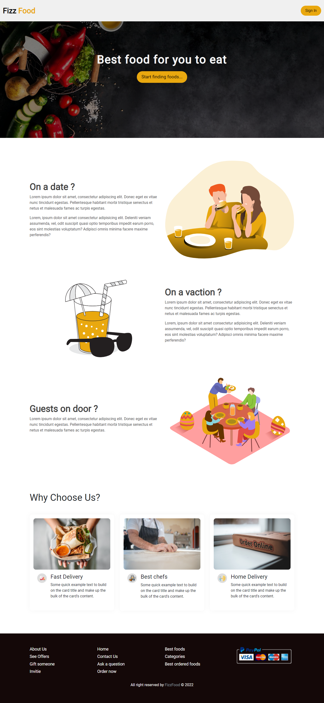

# `Fizz Food` - Web Application

## [LIVE VERSION 🔥](https://fizz-food.web.app/)

In this beautiful responsive and animation based web application users can create and sign in to their accounts. Can filter a add prefered foods catgories based. Users can edit their cart or remove items from their cart.

I have used google `react`, `context api`, `react-router-dom`, `firebase`[for auth], `localstorage`, `bootstrap` and custom `css`.

## To run this app:

1. Clone this repo
2. Run : `npm install`
3. Place your firebase config here 👉🏼 `src/firebase-config.js`
4. Run : `npm start`
